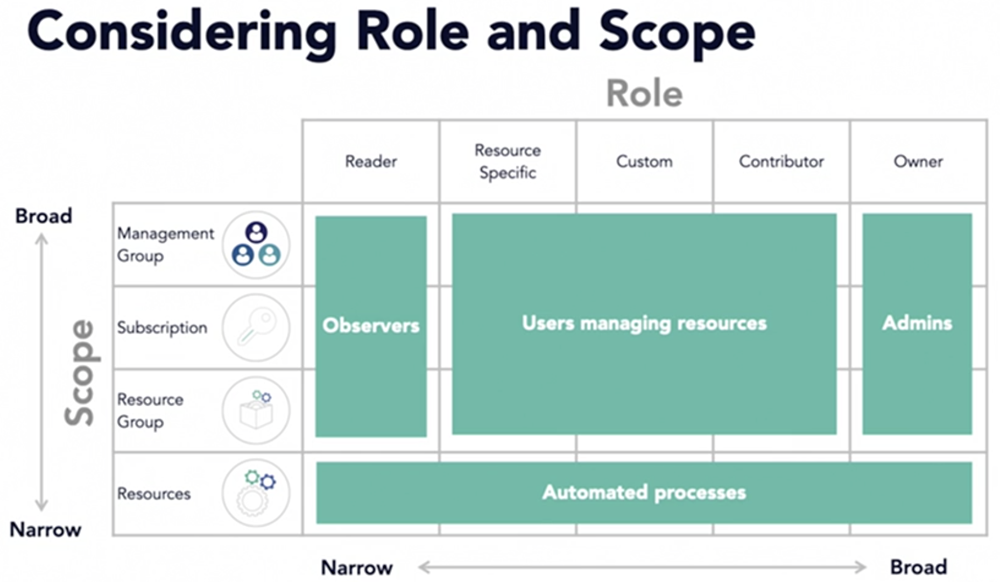

- Azure Roles: Roles focused on RBAC, scoped to Azure resource types: Owner, Contributor, Reader, User Access Administrator
- Azure AD Roles: Roles specific to identity and billing management: Global Administrator, User Administrator, Helpdesk Administrator and Billing Administrator
  
