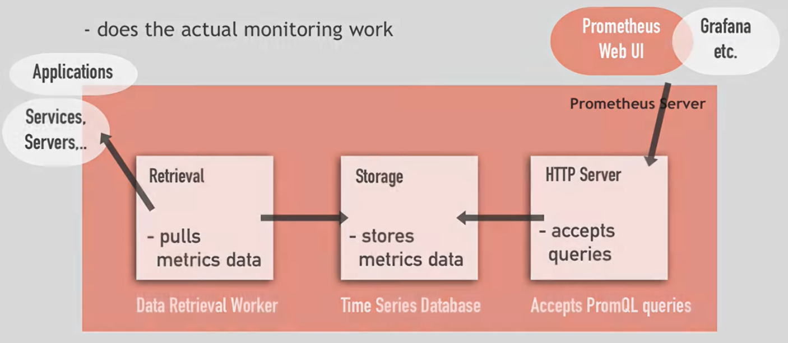

# Metric
- Counter: How many times x happened
- Gauge: What is the current value of x now?
- Histogram: How long or how big?

# How to collect Metric?
- Pull over Http for those available hostaddress/metrics
- Use Exporter: for those not available
- Use Client Library for own applications written in different languages

# Prometheus use Push Model to get metrics
- For those short live process such as batch scripts, use pushgateway

# Configuration
- prometheus.yml

# AlertManager and Database
- AlertManager send alerts via email, slack, etc after being pushed by prometheus server
- Database: Local (on Disk) or remote database systems

# PromQL Query Language
- Query Target directly
- Or Using Visualuation tool e.g. Grafana to query

# Reference:
- https://www.youtube.com/watch?v=h4Sl21AKiDg
- https://www.youtube.com/watch?v=QoDqxm7ybLc